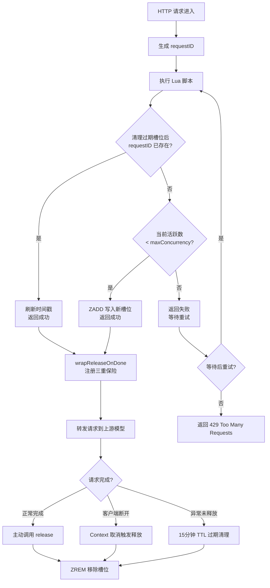

> 作者：litianc
>
> 时间：2026年3月2日
>
> 阅读时长：10分钟

## 前言

做过 AI 应用的同学大概都有过类似的经历：团队里好几个人共用一批模型账号，高峰期互相挤占、请求被拒，谁也不知道是谁的锅。尤其在多租户环境下，你不仅要管"同一时刻能跑多少请求"，还要管"同一个账号上挂了多少活跃会话"——这两个问题听着像一回事，实际上是两套完全不同的机制。

正好，我们采用一套模型聚合管理工具来统一管理多个 AI 模型账号的并发和会话。跑了一段时间都挺稳定，直到最近使用 OpenClaw 调用模型时出现了问题：管理页面上某个账号的"并发数"一直在涨，最后触达上限，新请求全被拒了。但奇怪的是，另一个客户端（Claude Code）走同样的通道却始终显示 1。

我的第一反应是：这不对，并发槽位是秒级释放的，不可能累加到 5 分钟后才回落。直觉告诉我，页面上显示的压根就不是我以为的那个"并发数"。

为了搞清楚，我把这套网关系统的并发控制代码从头到尾过了一遍。结论先放这儿：**页面显示的根本不是并发槽位（Concurrency Slot），而是会话数（Session Count）**。这是两套完全独立的机制。

## 一、背景：并发控制的两种粒度

在聊具体实现之前，先理清一个概念——并发控制在 API 网关里通常有两种粒度：

**请求级并发（Concurrency Slot）**：每个 HTTP 请求占一个槽位，请求结束即释放。粒度细、生命周期短（秒级），解决的是"同一时刻最多能跑多少请求"的问题。

**会话级限制（Session Limit）**：按会话（Session）计数，一个会话可能包含多轮请求。生命周期长（分钟级），靠空闲超时过期，解决的是"一个账号上最多能挂多少个活跃用户"的问题。

这两种机制用的是不同的 Redis Key、不同的计数方式、不同的释放策略。但在管理页面上，它们的数字长得一模一样——这就是坑的起点。

## 二、并发槽位机制详解

### 核心设计

我们的网关系统用 Redis Sorted Set（ZSET）来管理并发槽位。思路很简洁：每个 HTTP 请求进来时，服务端生成一个唯一的 `requestID`，通过 `ZADD` 写入 Redis；请求结束后用 `ZREM` 移除。ZSET 的 score 存时间戳，配合 `ZREMRANGEBYSCORE` 实现 15 分钟的 TTL 兜底清理。

一条并发 = 一个完整的 API 调用生命周期，不按 token 数、消息数或连接数计算。`requestID` 的格式是 `r{进程随机前缀}-{原子递增计数器的base36}`，服务端生成，客户端完全无感知。

### Lua 脚本：原子获取槽位

获取槽位的核心是一段 Lua 脚本，保证了整个"清理-检查-写入"操作的原子性：

```lua
-- 1. 先清理过期的僵尸槽位
ZREMRANGEBYSCORE key '-inf' (now - TTL)

-- 2. 支持重试：同一 requestID 只刷新时间戳，不重复计数
local exists = ZSCORE(key, requestID)
if exists then
    ZADD(key, now, requestID)
    return 1
end

-- 3. 检查容量，有空位就占
local count = ZCARD(key)
if count < maxConcurrency then
    ZADD(key, now, requestID)
    return 1
end

return 0  -- 已满，拒绝
```

这段脚本有两个我觉得设计得挺巧的地方。一是先清理过期再检查容量，确保不会因为僵尸槽位导致误拒。二是用 `ZSCORE` 检查 `requestID` 是否已存在，同一请求重试时只刷新时间戳——对上层重试逻辑非常友好。

### 释放机制：三重保险

槽位释放是整套机制里最关键的环节。你想，如果获取了槽位但没释放，那就是槽位泄漏，积累多了直接把账号的并发额度耗干。所以网关系统设计了三层保障：

```go
func wrapReleaseOnDone(ctx context.Context, releaseFunc func()) func() {
    var once sync.Once
    release := func() {
        once.Do(func() { releaseFunc() })
    }
    stop = context.AfterFunc(ctx, release)  // ctx 取消时自动释放
    return release
}
```

1. **正常路径**：业务代码主动调用 `release()`
2. **Context 取消兜底**：`context.AfterFunc` 注册回调，客户端断开连接时自动释放
3. **TTL 过期兜底**：如果以上都失败（比如进程崩了），15 分钟后 `ZREMRANGEBYSCORE` 自动清理

`sync.Once` 保证无论哪条路径先触发，释放逻辑只执行一次，不会重复调 `ZREM`。

另外还有一个细节值得一提：用户级槽位用 `defer` 释放（因为贯穿整个请求生命周期），而账号级槽位在循环里手动调用（因为重试时可能切换账号，需要先释放上一个）。这种区分是合理的——`defer` 虽然安全，但在需要提前释放的场景里反而会延迟释放。

### 槽位生命周期流程图



## 三、排查实录：一个数字引发的追查

### 现象

故事的起点很简单。有同事反馈说某个模型账号的请求总是失败，打开管理页面一看——"并发数"显示 5/5，满了。但实际上当时没有任何活跃的请求在跑。

更蹊跷的是，我用另一个客户端（Claude Code）连同一个账号试了下，页面上始终显示 1，怎么请求都不涨。而出问题的客户端（OpenClaw）每发一次请求就 +1，停下来之后要等大概 5 分钟才慢慢回落。

### 第一个假设：槽位泄漏

我最先怀疑的是并发槽位没正常释放。毕竟 5 分钟不回落，看着确实像是泄漏了。于是我去查了释放逻辑——上面分析过的三重保险机制。从代码上看，正常路径有 `release()`，异常路径有 `context.AfterFunc`，最差还有 15 分钟 TTL。

但等等，回落时间是 5 分钟左右，不是 15 分钟。如果是 TTL 兜底清理，应该要等更久。所以这不像是并发槽位的 TTL 在起作用，而是另一个有自己超时时间的机制。

槽位泄漏的假设基本可以排除了。

### 第二个假设：两套计数机制

既然不是槽位泄漏，那页面上显示的"并发数"到底是什么？我去翻了前端代码和后端接口，发现一个关键线索：页面查询的 Redis Key 不是 `concurrency:account:{id}`，而是 `session_limit:account:{id}`。

名字叫"并发数"，实际读的是"会话数"。（这命名，属实有点坑人。）

顺着 `session_limit` 这条线索继续挖，我找到了一套完全独立的会话限制机制：

| | 并发槽位 | 会话限制 |
|---|---|---|
| Redis Key | `concurrency:account:{id}` | `session_limit:account:{id}` |
| ZSET 成员 | `requestID`（每次请求唯一） | `sessionHash`（同一会话固定） |
| 生命周期 | 请求开始 → 请求结束（秒级） | 首次注册 → 空闲超时过期（分钟级） |
| 释放方式 | `ZREM` 主动释放 | **无主动释放**，靠空闲超时自动过期 |

两套机制各管各的，但在管理页面上共享了同一个"并发数"的标签。这就解释了为什么回落时间是 5 分钟——那是会话的空闲超时时间，不是并发槽位的 TTL。

### 找到根因

接下来的问题就是：为什么 Claude Code 始终显示 1，而我们的 OpenClaw 会不断累加？

`sessionHash` 的生成逻辑依赖请求体中的 `metadata.user_id` 字段。这个字段的格式是 `user_{hex}_account__session_{uuid}`，网关会从中提取 session UUID 来计算哈希。

- **Claude Code**：每次请求都带 `metadata.user_id`，其中包含固定的 session UUID。所以 `sessionHash` 始终相同，`RegisterSession` 发现已存在就只刷新时间戳——永远是 1 个会话。
- **OpenClaw**：通过 SDK 调用同一个接口，但不带 `metadata.user_id`（或者格式不符合预期）。结果每次请求生成的 `sessionHash` 都不一样，每次都被当成新会话注册，不断累加。

真相大白。问题不在并发槽位，不在释放机制，而在于**不同客户端的会话标识行为差异**。

## 四、根因与修复

### 问题本质

总结一下根因：网关系统的会话限制机制依赖客户端在请求体中传递 `metadata.user_id` 来生成稳定的 `sessionHash`。某些客户端（如 Claude Code）天然会带这个字段，而 OpenClaw 通过通用 SDK 调用时并没有传递——导致每次请求都被识别为新会话。

### 两个修复方案

**方案 A：客户端侧适配**

让 OpenClaw 在请求体的 `metadata.user_id` 中带上固定的 session UUID。改动量小，但需要客户端配合修改。

**方案 B：网关侧兼容**

在网关系统侧，对没有 `metadata.user_id` 的请求，用其他标识（如 API Key ID + 客户端 IP）生成稳定的 `sessionHash`。对客户端透明，但需要改网关代码。

### 最终选择与验证

考虑到我们对 OpenClaw 的代码有完全的控制权，最终选了方案 A。改动确实很小——在 SDK 调用时构造一个固定格式的 `metadata.user_id`，把 OpenClaw 的用户 ID 和一个稳定的 session 标识拼进去就行。

改完之后做了一轮验证：

1. **单客户端测试**：用修改后的 OpenClaw 连续发送 20 次请求，管理页面始终显示 1 个会话。之前同样的操作会累加到 20。
2. **多客户端并行**：同时用 Claude Code 和修改后的 OpenClaw 访问同一个账号，页面显示 2 个会话（各一个），符合预期。
3. **空闲超时验证**：停止请求后等待 5 分钟，会话数自动回落到 0，TTL 机制正常工作。
4. **并发槽位不受影响**：并发槽位的获取释放逻辑没有任何变化，高并发场景下表现和之前一致。

问题解决。整个修复从定位到上线大概花了半天，其中大部分时间其实花在了理解那两套机制的区别上。

## 五、总结

这次排查的收获不只是修了一个 bug，更重要的是理清了网关系统并发控制的整套设计。几个值得借鉴的点：

1. **Lua 脚本保证原子性**：获取槽位的"清理-检查-写入"三步操作放在一个 Lua 脚本里执行，避免了分布式环境下的竞态条件。这个模式在 Redis 限流场景里非常通用。
2. **三重释放保险**：正常释放 + Context 兜底 + TTL 过期，层层递进，确保不会有槽位泄漏。做过 Go 服务的同学应该知道，资源泄漏是最难排查的问题之一，多一层保险总没错。
3. **requestID 的幂等设计**：同一 requestID 重试不重复计数，对上层重试逻辑非常友好。
4. **并发槽位与会话限制分离**：两套机制各管各的，粒度不同、生命周期不同。设计上是解耦的，但在运维可观测性上要注意区分——标签一旦混淆，排查方向就全歪了。

回过头来看，这类问题的排查思路始终是一样的：**先确认你看到的指标到底是什么，再去找对应的代码路径**。页面上写着"并发数"，实际跑的是会话计数逻辑——名字骗了我，代码不会骗人。

后续打算把管理页面的显示也优化一下，把"并发数"和"会话数"拆成两个独立指标，避免下一个接手的人再掉进同样的坑里。
